# Importing necessary library for Data Analysis


```python
import pandas as pd
#Read the csv file
df = pd.read_csv("C:/Users/itzan/Desktop/CVS files/Iris.csv")
```


```python
#to show the top 5 rows printing of dataset
df.head()
```


<div>
<style scoped>
    .dataframe tbody tr th:only-of-type {
        vertical-align: middle;
    }

    .dataframe tbody tr th {
        vertical-align: top;
    }

    .dataframe thead th {
        text-align: right;
    }
</style>
<table border="1" class="dataframe">
  <thead>
    <tr style="text-align: right;">
      <th></th>
      <th>Id</th>
      <th>SepalLengthCm</th>
      <th>SepalWidthCm</th>
      <th>PetalLengthCm</th>
      <th>PetalWidthCm</th>
      <th>Species</th>
    </tr>
  </thead>
  <tbody>
    <tr>
      <th>0</th>
      <td>1</td>
      <td>5.1</td>
      <td>3.5</td>
      <td>1.4</td>
      <td>0.2</td>
      <td>Iris-setosa</td>
    </tr>
    <tr>
      <th>1</th>
      <td>2</td>
      <td>4.9</td>
      <td>3.0</td>
      <td>1.4</td>
      <td>0.2</td>
      <td>Iris-setosa</td>
    </tr>
    <tr>
      <th>2</th>
      <td>3</td>
      <td>4.7</td>
      <td>3.2</td>
      <td>1.3</td>
      <td>0.2</td>
      <td>Iris-setosa</td>
    </tr>
    <tr>
      <th>3</th>
      <td>4</td>
      <td>4.6</td>
      <td>3.1</td>
      <td>1.5</td>
      <td>0.2</td>
      <td>Iris-setosa</td>
    </tr>
    <tr>
      <th>4</th>
      <td>5</td>
      <td>5.0</td>
      <td>3.6</td>
      <td>1.4</td>
      <td>0.2</td>
      <td>Iris-setosa</td>
    </tr>
  </tbody>
</table>
</div>


```python
#to show the bottom 5 rows printing
df.tail()
```


<div>
<style scoped>
    .dataframe tbody tr th:only-of-type {
        vertical-align: middle;
    }

    .dataframe tbody tr th {
        vertical-align: top;
    }

    .dataframe thead th {
        text-align: right;
    }
</style>
<table border="1" class="dataframe">
  <thead>
    <tr style="text-align: right;">
      <th></th>
      <th>Id</th>
      <th>SepalLengthCm</th>
      <th>SepalWidthCm</th>
      <th>PetalLengthCm</th>
      <th>PetalWidthCm</th>
      <th>Species</th>
    </tr>
  </thead>
  <tbody>
    <tr>
      <th>145</th>
      <td>146</td>
      <td>6.7</td>
      <td>3.0</td>
      <td>5.2</td>
      <td>2.3</td>
      <td>Iris-virginica</td>
    </tr>
    <tr>
      <th>146</th>
      <td>147</td>
      <td>6.3</td>
      <td>2.5</td>
      <td>5.0</td>
      <td>1.9</td>
      <td>Iris-virginica</td>
    </tr>
    <tr>
      <th>147</th>
      <td>148</td>
      <td>6.5</td>
      <td>3.0</td>
      <td>5.2</td>
      <td>2.0</td>
      <td>Iris-virginica</td>
    </tr>
    <tr>
      <th>148</th>
      <td>149</td>
      <td>6.2</td>
      <td>3.4</td>
      <td>5.4</td>
      <td>2.3</td>
      <td>Iris-virginica</td>
    </tr>
    <tr>
      <th>149</th>
      <td>150</td>
      <td>5.9</td>
      <td>3.0</td>
      <td>5.1</td>
      <td>1.8</td>
      <td>Iris-virginica</td>
    </tr>
  </tbody>
</table>
</div>


```python
#for printing complete dataset
df
```


<div>
<style scoped>
    .dataframe tbody tr th:only-of-type {
        vertical-align: middle;
    }

    .dataframe tbody tr th {
        vertical-align: top;
    }

    .dataframe thead th {
        text-align: right;
    }
</style>
<table border="1" class="dataframe">
  <thead>
    <tr style="text-align: right;">
      <th></th>
      <th>Id</th>
      <th>SepalLengthCm</th>
      <th>SepalWidthCm</th>
      <th>PetalLengthCm</th>
      <th>PetalWidthCm</th>
      <th>Species</th>
    </tr>
  </thead>
  <tbody>
    <tr>
      <th>0</th>
      <td>1</td>
      <td>5.1</td>
      <td>3.5</td>
      <td>1.4</td>
      <td>0.2</td>
      <td>Iris-setosa</td>
    </tr>
    <tr>
      <th>1</th>
      <td>2</td>
      <td>4.9</td>
      <td>3.0</td>
      <td>1.4</td>
      <td>0.2</td>
      <td>Iris-setosa</td>
    </tr>
    <tr>
      <th>2</th>
      <td>3</td>
      <td>4.7</td>
      <td>3.2</td>
      <td>1.3</td>
      <td>0.2</td>
      <td>Iris-setosa</td>
    </tr>
    <tr>
      <th>3</th>
      <td>4</td>
      <td>4.6</td>
      <td>3.1</td>
      <td>1.5</td>
      <td>0.2</td>
      <td>Iris-setosa</td>
    </tr>
    <tr>
      <th>4</th>
      <td>5</td>
      <td>5.0</td>
      <td>3.6</td>
      <td>1.4</td>
      <td>0.2</td>
      <td>Iris-setosa</td>
    </tr>
    <tr>
      <th>...</th>
      <td>...</td>
      <td>...</td>
      <td>...</td>
      <td>...</td>
      <td>...</td>
      <td>...</td>
    </tr>
    <tr>
      <th>145</th>
      <td>146</td>
      <td>6.7</td>
      <td>3.0</td>
      <td>5.2</td>
      <td>2.3</td>
      <td>Iris-virginica</td>
    </tr>
    <tr>
      <th>146</th>
      <td>147</td>
      <td>6.3</td>
      <td>2.5</td>
      <td>5.0</td>
      <td>1.9</td>
      <td>Iris-virginica</td>
    </tr>
    <tr>
      <th>147</th>
      <td>148</td>
      <td>6.5</td>
      <td>3.0</td>
      <td>5.2</td>
      <td>2.0</td>
      <td>Iris-virginica</td>
    </tr>
    <tr>
      <th>148</th>
      <td>149</td>
      <td>6.2</td>
      <td>3.4</td>
      <td>5.4</td>
      <td>2.3</td>
      <td>Iris-virginica</td>
    </tr>
    <tr>
      <th>149</th>
      <td>150</td>
      <td>5.9</td>
      <td>3.0</td>
      <td>5.1</td>
      <td>1.8</td>
      <td>Iris-virginica</td>
    </tr>
  </tbody>
</table>
<p>150 rows × 6 columns</p>
</div>


```python
#to read more than 5 rows of dataset
df.head(10)
df.tail(10)
```


<div>
<style scoped>
    .dataframe tbody tr th:only-of-type {
        vertical-align: middle;
    }

    .dataframe tbody tr th {
        vertical-align: top;
    }

    .dataframe thead th {
        text-align: right;
    }
</style>
<table border="1" class="dataframe">
  <thead>
    <tr style="text-align: right;">
      <th></th>
      <th>Id</th>
      <th>SepalLengthCm</th>
      <th>SepalWidthCm</th>
      <th>PetalLengthCm</th>
      <th>PetalWidthCm</th>
      <th>Species</th>
    </tr>
  </thead>
  <tbody>
    <tr>
      <th>140</th>
      <td>141</td>
      <td>6.7</td>
      <td>3.1</td>
      <td>5.6</td>
      <td>2.4</td>
      <td>Iris-virginica</td>
    </tr>
    <tr>
      <th>141</th>
      <td>142</td>
      <td>6.9</td>
      <td>3.1</td>
      <td>5.1</td>
      <td>2.3</td>
      <td>Iris-virginica</td>
    </tr>
    <tr>
      <th>142</th>
      <td>143</td>
      <td>5.8</td>
      <td>2.7</td>
      <td>5.1</td>
      <td>1.9</td>
      <td>Iris-virginica</td>
    </tr>
    <tr>
      <th>143</th>
      <td>144</td>
      <td>6.8</td>
      <td>3.2</td>
      <td>5.9</td>
      <td>2.3</td>
      <td>Iris-virginica</td>
    </tr>
    <tr>
      <th>144</th>
      <td>145</td>
      <td>6.7</td>
      <td>3.3</td>
      <td>5.7</td>
      <td>2.5</td>
      <td>Iris-virginica</td>
    </tr>
    <tr>
      <th>145</th>
      <td>146</td>
      <td>6.7</td>
      <td>3.0</td>
      <td>5.2</td>
      <td>2.3</td>
      <td>Iris-virginica</td>
    </tr>
    <tr>
      <th>146</th>
      <td>147</td>
      <td>6.3</td>
      <td>2.5</td>
      <td>5.0</td>
      <td>1.9</td>
      <td>Iris-virginica</td>
    </tr>
    <tr>
      <th>147</th>
      <td>148</td>
      <td>6.5</td>
      <td>3.0</td>
      <td>5.2</td>
      <td>2.0</td>
      <td>Iris-virginica</td>
    </tr>
    <tr>
      <th>148</th>
      <td>149</td>
      <td>6.2</td>
      <td>3.4</td>
      <td>5.4</td>
      <td>2.3</td>
      <td>Iris-virginica</td>
    </tr>
    <tr>
      <th>149</th>
      <td>150</td>
      <td>5.9</td>
      <td>3.0</td>
      <td>5.1</td>
      <td>1.8</td>
      <td>Iris-virginica</td>
    </tr>
  </tbody>
</table>
</div>


```python
#get the information of the dataset
#shape parameter
df.shape
```


    (150, 6)


```python
#to get the information of datatype we will use info
df.info()
```

    <class 'pandas.core.frame.DataFrame'>
    RangeIndex: 150 entries, 0 to 149
    Data columns (total 6 columns):
     #   Column         Non-Null Count  Dtype  
    ---  ------         --------------  -----  
     0   Id             150 non-null    int64  
     1   SepalLengthCm  150 non-null    float64
     2   SepalWidthCm   150 non-null    float64
     3   PetalLengthCm  150 non-null    float64
     4   PetalWidthCm   150 non-null    float64
     5   Species        150 non-null    object 
    dtypes: float64(4), int64(1), object(1)
    memory usage: 7.2+ KB
    


```python
#Data cleaning-new topic
#for calculating mean,median,mode
df.describe()
```


<div>
<style scoped>
    .dataframe tbody tr th:only-of-type {
        vertical-align: middle;
    }

    .dataframe tbody tr th {
        vertical-align: top;
    }

    .dataframe thead th {
        text-align: right;
    }
</style>
<table border="1" class="dataframe">
  <thead>
    <tr style="text-align: right;">
      <th></th>
      <th>Id</th>
      <th>SepalLengthCm</th>
      <th>SepalWidthCm</th>
      <th>PetalLengthCm</th>
      <th>PetalWidthCm</th>
    </tr>
  </thead>
  <tbody>
    <tr>
      <th>count</th>
      <td>150.000000</td>
      <td>150.000000</td>
      <td>150.000000</td>
      <td>150.000000</td>
      <td>150.000000</td>
    </tr>
    <tr>
      <th>mean</th>
      <td>75.500000</td>
      <td>5.843333</td>
      <td>3.054000</td>
      <td>3.758667</td>
      <td>1.198667</td>
    </tr>
    <tr>
      <th>std</th>
      <td>43.445368</td>
      <td>0.828066</td>
      <td>0.433594</td>
      <td>1.764420</td>
      <td>0.763161</td>
    </tr>
    <tr>
      <th>min</th>
      <td>1.000000</td>
      <td>4.300000</td>
      <td>2.000000</td>
      <td>1.000000</td>
      <td>0.100000</td>
    </tr>
    <tr>
      <th>25%</th>
      <td>38.250000</td>
      <td>5.100000</td>
      <td>2.800000</td>
      <td>1.600000</td>
      <td>0.300000</td>
    </tr>
    <tr>
      <th>50%</th>
      <td>75.500000</td>
      <td>5.800000</td>
      <td>3.000000</td>
      <td>4.350000</td>
      <td>1.300000</td>
    </tr>
    <tr>
      <th>75%</th>
      <td>112.750000</td>
      <td>6.400000</td>
      <td>3.300000</td>
      <td>5.100000</td>
      <td>1.800000</td>
    </tr>
    <tr>
      <th>max</th>
      <td>150.000000</td>
      <td>7.900000</td>
      <td>4.400000</td>
      <td>6.900000</td>
      <td>2.500000</td>
    </tr>
  </tbody>
</table>
</div>


```python
#Check Missing values
#to check whether their is null value in data or not
df.isnull().sum()


```


    Id               0
    SepalLengthCm    0
    SepalWidthCm     0
    PetalLengthCm    0
    PetalWidthCm     0
    Species          0
    dtype: int64


```python
#to remove duplicate value in data
data=df.drop_duplicates(subset="Species")
data
```


<div>
<style scoped>
    .dataframe tbody tr th:only-of-type {
        vertical-align: middle;
    }

    .dataframe tbody tr th {
        vertical-align: top;
    }

    .dataframe thead th {
        text-align: right;
    }
</style>
<table border="1" class="dataframe">
  <thead>
    <tr style="text-align: right;">
      <th></th>
      <th>Id</th>
      <th>SepalLengthCm</th>
      <th>SepalWidthCm</th>
      <th>PetalLengthCm</th>
      <th>PetalWidthCm</th>
      <th>Species</th>
    </tr>
  </thead>
  <tbody>
    <tr>
      <th>0</th>
      <td>1</td>
      <td>5.1</td>
      <td>3.5</td>
      <td>1.4</td>
      <td>0.2</td>
      <td>Iris-setosa</td>
    </tr>
    <tr>
      <th>50</th>
      <td>51</td>
      <td>7.0</td>
      <td>3.2</td>
      <td>4.7</td>
      <td>1.4</td>
      <td>Iris-versicolor</td>
    </tr>
    <tr>
      <th>100</th>
      <td>101</td>
      <td>6.3</td>
      <td>3.3</td>
      <td>6.0</td>
      <td>2.5</td>
      <td>Iris-virginica</td>
    </tr>
  </tbody>
</table>
</div>


```python
#function returns a series containing count of unique values
df.value_counts("Species")
```


    Species
    Iris-setosa        50
    Iris-versicolor    50
    Iris-virginica     50
    dtype: int64


# Importing necessary library for Data Visualization


```python
import seaborn as sns
import matplotlib.pyplot as plt
#for displaying the output
sns.countplot(x="Species",data=df)
plt.show()
```


    
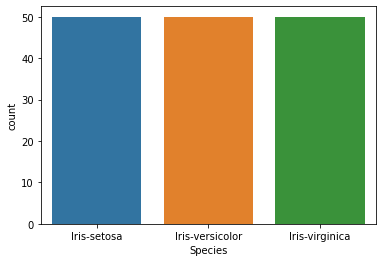
    


```python
#TO SHOW SCATTERPLOT of Species
sns.scatterplot(x="SepalLengthCm",y="SepalWidthCm",hue="Species",data=df)
plt.show()
```


    
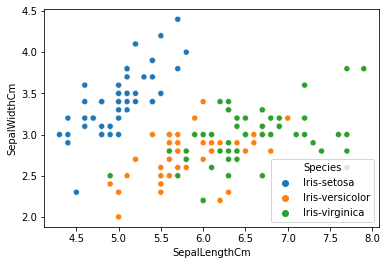
    


```python
#TO SHOW SCATTERPLOT of Petal
sns.scatterplot(x="PetalLengthCm",y="PetalWidthCm",hue="Species",data=df)
plt.show()
```


    
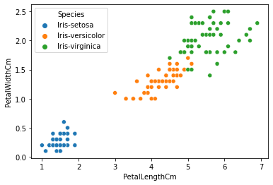
    


```python
#Pairplot
#this is the parameter for color encoading
sns.pairplot(df.drop(['Id'],axis=1),hue="Species",height=3)
plt.show()
```


    
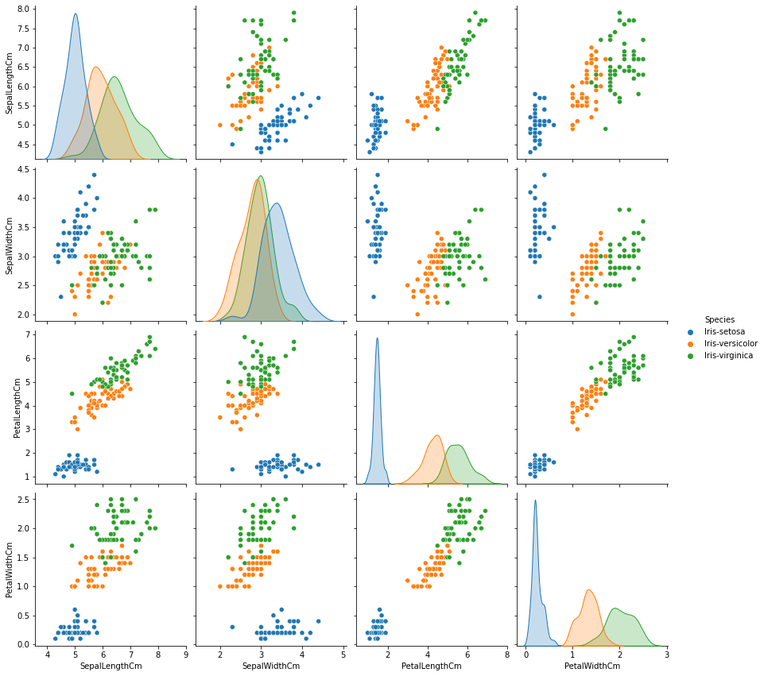
    


```python
#Histogram
fig, axes=plt.subplots(2,2,figsize=(10,10))

axes[0,0].set_title("SepalLength")
axes[0,0].hist(df["SepalLengthCm"], bins=10)

axes[0,1].set_title("SepalWidth")
axes[0,1].hist(df["SepalWidthCm"], bins=10)


```


    (array([ 4.,  7., 22., 24., 38., 31.,  9., 11.,  2.,  2.]),
     array([2.  , 2.24, 2.48, 2.72, 2.96, 3.2 , 3.44, 3.68, 3.92, 4.16, 4.4 ]),
     <BarContainer object of 10 artists>)


    
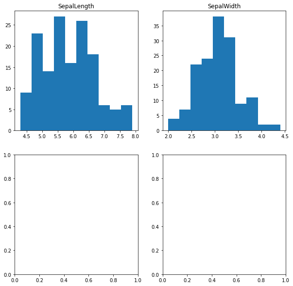
    


```python
#Histogram
fig, axes=plt.subplots(2,2,figsize=(10,10))

axes[0,0].set_title("PetalLength")
axes[0,0].hist(df["PetalLengthCm"], bins=10)

axes[0,1].set_title("PetalWidth")
axes[0,1].hist(df["PetalWidthCm"], bins=10)
```


    (array([41.,  8.,  1.,  7.,  8., 33.,  6., 23.,  9., 14.]),
     array([0.1 , 0.34, 0.58, 0.82, 1.06, 1.3 , 1.54, 1.78, 2.02, 2.26, 2.5 ]),
     <BarContainer object of 10 artists>)


    
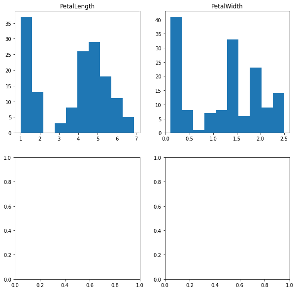
    


```python
#Histogram with Distplot
import seaborn as sns
import matplotlib.pyplot as plt
#ignore warning
import warnings
warnings.filterwarnings("ignore")

plot = sns.FacetGrid(df,hue="Species")
plot.map(sns.distplot,"SepalWidthCm").add_legend()

plot = sns.FacetGrid(df,hue="Species")
plot.map(sns.distplot,"PetalWidthCm").add_legend()
```


    <seaborn.axisgrid.FacetGrid at 0x22edfa8bcd0>


    
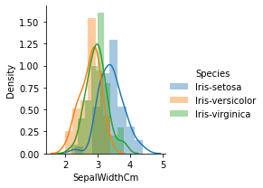
    


    
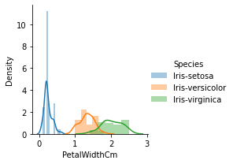
    


```python
#Histogram with Distplot
import seaborn as sns
import matplotlib.pyplot as plt
#ignore warning
import warnings
warnings.filterwarnings("ignore")

plot = sns.FacetGrid(df,hue="Species")
plot.map(sns.distplot,"SepalLengthCm").add_legend()

plot = sns.FacetGrid(df,hue="Species")
plot.map(sns.distplot,"PetalLengthCm").add_legend()
```


    <seaborn.axisgrid.FacetGrid at 0x22ee0067040>


    
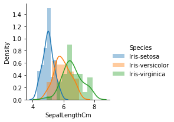
    


    
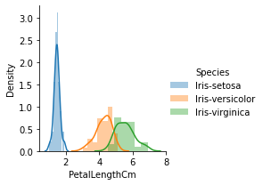
    


```python
# Correlation using only numeric columns
numeric_columns = df.select_dtypes(include=['float64', 'int64'])
numeric_columns.corr(method='pearson')
```


<div>
<style scoped>
    .dataframe tbody tr th:only-of-type {
        vertical-align: middle;
    }

    .dataframe tbody tr th {
        vertical-align: top;
    }

    .dataframe thead th {
        text-align: right;
    }
</style>
<table border="1" class="dataframe">
  <thead>
    <tr style="text-align: right;">
      <th></th>
      <th>Id</th>
      <th>SepalLengthCm</th>
      <th>SepalWidthCm</th>
      <th>PetalLengthCm</th>
      <th>PetalWidthCm</th>
    </tr>
  </thead>
  <tbody>
    <tr>
      <th>Id</th>
      <td>1.000000</td>
      <td>0.716676</td>
      <td>-0.397729</td>
      <td>0.882747</td>
      <td>0.899759</td>
    </tr>
    <tr>
      <th>SepalLengthCm</th>
      <td>0.716676</td>
      <td>1.000000</td>
      <td>-0.109369</td>
      <td>0.871754</td>
      <td>0.817954</td>
    </tr>
    <tr>
      <th>SepalWidthCm</th>
      <td>-0.397729</td>
      <td>-0.109369</td>
      <td>1.000000</td>
      <td>-0.420516</td>
      <td>-0.356544</td>
    </tr>
    <tr>
      <th>PetalLengthCm</th>
      <td>0.882747</td>
      <td>0.871754</td>
      <td>-0.420516</td>
      <td>1.000000</td>
      <td>0.962757</td>
    </tr>
    <tr>
      <th>PetalWidthCm</th>
      <td>0.899759</td>
      <td>0.817954</td>
      <td>-0.356544</td>
      <td>0.962757</td>
      <td>1.000000</td>
    </tr>
  </tbody>
</table>
</div>


```python
#Droping ID colum as it is of no use in classifing the class labels..

df.drop(["Id"],axis=1,inplace=True)
```

# Iris data analysis using Decision Tree


```python
#Now we try to create a model to solve our task
#As per our analysis 

'''Importing few library for create Decision tree Classifier and Visualising the tree structure'''
from sklearn import tree
from sklearn.tree import DecisionTreeClassifier
from sklearn.model_selection import train_test_split, cross_val_score

#here we separating independent variable or target variable from dataset


x = df[["SepalLengthCm","SepalWidthCm","PetalLengthCm","PetalWidthCm"]]
y = df["Species"]
#Before training the model we have split our data 
Xtrain, Xtest, Ytrain, Ytest = train_test_split(x,y, test_size=0.30,random_state=42)
#Spiliting data into validation train and validation test
Xt,Xcv,Yt,Ycv = train_test_split(Xtrain, Ytrain, test_size=0.10, random_state=42)

'''Now we have create a Decision tree classifier and trained it with training dataset'''

Iris_clf = DecisionTreeClassifier(criterion="gini",min_samples_split=2)
Iris_clf.fit(Xt,Yt)

#Visualised the tree which is formed on train dataset

tree.plot_tree(Iris_clf)
```


    [Text(111.60000000000001, 201.90857142857143, 'X[2] <= 2.6\ngini = 0.665\nsamples = 94\nvalue = [30, 30, 34]'),
     Text(74.4, 170.84571428571428, 'gini = 0.0\nsamples = 30\nvalue = [30, 0, 0]'),
     Text(148.8, 170.84571428571428, 'X[3] <= 1.55\ngini = 0.498\nsamples = 64\nvalue = [0, 30, 34]'),
     Text(74.4, 139.78285714285715, 'X[2] <= 5.0\ngini = 0.124\nsamples = 30\nvalue = [0, 28, 2]'),
     Text(37.2, 108.72, 'gini = 0.0\nsamples = 28\nvalue = [0, 28, 0]'),
     Text(111.60000000000001, 108.72, 'gini = 0.0\nsamples = 2\nvalue = [0, 0, 2]'),
     Text(223.20000000000002, 139.78285714285715, 'X[2] <= 5.05\ngini = 0.111\nsamples = 34\nvalue = [0, 2, 32]'),
     Text(186.0, 108.72, 'X[1] <= 2.9\ngini = 0.375\nsamples = 8\nvalue = [0, 2, 6]'),
     Text(148.8, 77.65714285714284, 'gini = 0.0\nsamples = 5\nvalue = [0, 0, 5]'),
     Text(223.20000000000002, 77.65714285714284, 'X[3] <= 1.75\ngini = 0.444\nsamples = 3\nvalue = [0, 2, 1]'),
     Text(186.0, 46.59428571428572, 'gini = 0.0\nsamples = 1\nvalue = [0, 1, 0]'),
     Text(260.40000000000003, 46.59428571428572, 'X[0] <= 5.95\ngini = 0.5\nsamples = 2\nvalue = [0, 1, 1]'),
     Text(223.20000000000002, 15.531428571428563, 'gini = 0.0\nsamples = 1\nvalue = [0, 1, 0]'),
     Text(297.6, 15.531428571428563, 'gini = 0.0\nsamples = 1\nvalue = [0, 0, 1]'),
     Text(260.40000000000003, 108.72, 'gini = 0.0\nsamples = 26\nvalue = [0, 0, 26]')]


    
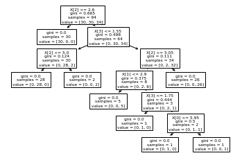
    


```python
#As our model has been trained...
#Now we can validate our decision tree using cross validation method to get the accuracy or performance score of our model

print("Accuracy score is:",cross_val_score(Iris_clf, Xt,Yt,cv=3,scoring="accuracy").mean())
```

    Accuracy score is: 0.9361559139784946
    


```python
#Checking validation test data on our trained model and getting performance metrices

from sklearn.metrics import multilabel_confusion_matrix, accuracy_score

Y_hat=Iris_clf.predict(Xcv)

print("Accuracy score for validation test data is:",accuracy_score(Ycv,Y_hat))

multilabel_confusion_matrix(Ycv,Y_hat)
```

    Accuracy score for validation test data is: 0.8181818181818182
    


    array([[[10,  0],
            [ 0,  1]],
    
           [[ 3,  1],
            [ 1,  6]],
    
           [[ 7,  1],
            [ 1,  2]]], dtype=int64)


```python
#checking our model performance on actual unseen test data..
Y_hat = Iris_clf.predict(Xtest)
Y_hat

print("Model Accuracy score on totally unseen data(Xtest) is:",accuracy_score(Ytest, Y_hat)*100,"%")
multilabel_confusion_matrix(Ytest, Y_hat)
```

    Model Accuracy score on totally unseen data(Xtest) is: 100.0 %
    


    array([[[26,  0],
            [ 0, 19]],
    
           [[32,  0],
            [ 0, 13]],
    
           [[32,  0],
            [ 0, 13]]], dtype=int64)


```python
''''Training model on Actual train data...'''
Iris_Fclf = DecisionTreeClassifier(criterion="gini",min_samples_split=2)
Iris_Fclf.fit(Xtrain, Ytrain)

#Visualising tree strecture.

tree.plot_tree(Iris_Fclf)
```


    [Text(167.4, 199.32, 'X[3] <= 0.8\ngini = 0.664\nsamples = 105\nvalue = [31, 37, 37]'),
     Text(141.64615384615385, 163.07999999999998, 'gini = 0.0\nsamples = 31\nvalue = [31, 0, 0]'),
     Text(193.15384615384616, 163.07999999999998, 'X[3] <= 1.75\ngini = 0.5\nsamples = 74\nvalue = [0, 37, 37]'),
     Text(103.01538461538462, 126.83999999999999, 'X[2] <= 4.95\ngini = 0.214\nsamples = 41\nvalue = [0, 36, 5]'),
     Text(51.50769230769231, 90.6, 'X[3] <= 1.6\ngini = 0.056\nsamples = 35\nvalue = [0, 34, 1]'),
     Text(25.753846153846155, 54.359999999999985, 'gini = 0.0\nsamples = 34\nvalue = [0, 34, 0]'),
     Text(77.26153846153846, 54.359999999999985, 'gini = 0.0\nsamples = 1\nvalue = [0, 0, 1]'),
     Text(154.52307692307693, 90.6, 'X[3] <= 1.55\ngini = 0.444\nsamples = 6\nvalue = [0, 2, 4]'),
     Text(128.76923076923077, 54.359999999999985, 'gini = 0.0\nsamples = 3\nvalue = [0, 0, 3]'),
     Text(180.27692307692308, 54.359999999999985, 'X[0] <= 6.95\ngini = 0.444\nsamples = 3\nvalue = [0, 2, 1]'),
     Text(154.52307692307693, 18.119999999999976, 'gini = 0.0\nsamples = 2\nvalue = [0, 2, 0]'),
     Text(206.03076923076924, 18.119999999999976, 'gini = 0.0\nsamples = 1\nvalue = [0, 0, 1]'),
     Text(283.2923076923077, 126.83999999999999, 'X[2] <= 4.85\ngini = 0.059\nsamples = 33\nvalue = [0, 1, 32]'),
     Text(257.53846153846155, 90.6, 'X[0] <= 5.95\ngini = 0.444\nsamples = 3\nvalue = [0, 1, 2]'),
     Text(231.7846153846154, 54.359999999999985, 'gini = 0.0\nsamples = 1\nvalue = [0, 1, 0]'),
     Text(283.2923076923077, 54.359999999999985, 'gini = 0.0\nsamples = 2\nvalue = [0, 0, 2]'),
     Text(309.04615384615386, 90.6, 'gini = 0.0\nsamples = 30\nvalue = [0, 0, 30]')]


    
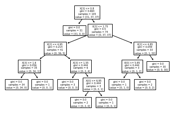
    


```python
#Final decision tree building for deploying in real world cases...
import graphviz
from sklearn import tree

dot_data = tree.export_graphviz(Iris_Fclf, out_file=None)
graph = graphviz.Source(dot_data)
graph.render("iris_decision_tree")  # This will render the decision tree to a file
```


```python
# Assuming you want to use scikit-learn's confusion_matrix function
from sklearn.metrics import confusion_matrix

# Checking the performance of model on actual test data...
YT_Fhat = Iris_Fclf.predict(Xtest)
YT_Fhat

print("Model Accuracy score on totally unseen data(Xtest) is:", accuracy_score(Ytest, YT_Fhat)*100, "%")
confusion_matrix(Ytest, YT_Fhat)
```

    Model Accuracy score on totally unseen data(Xtest) is: 100.0 %
    


    array([[19,  0,  0],
           [ 0, 13,  0],
           [ 0,  0, 13]], dtype=int64)


```python
# Assuming you have a trained DecisionTreeClassifier model named Iris_Fclf

# Remove the extra feature from each test point
Test_points = [[5.4,3.0,4.5,1.5],
               [6.5,2.8,4.6,1.3],
               [5.1,2.5,3.0,1.4],
               [5.1,3.3,1.7,1.2],
               [6.0,2.7,5.1,1.1],
               [6.0,2.2,5.0,0.7]]

# Make predictions using the trained model
print(Iris_Fclf.predict(Test_points))
```

    ['Iris-versicolor' 'Iris-versicolor' 'Iris-versicolor' 'Iris-versicolor'
     'Iris-virginica' 'Iris-setosa']
    


```python

```


```python

```
